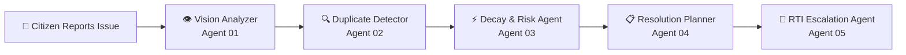
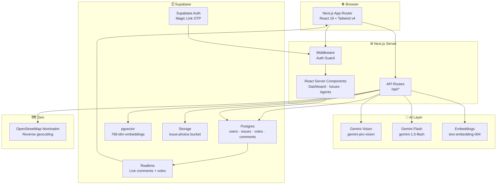

<div align="center">

# NEXORA

### Network of Engaged eXperts for Operations And Rapid Action

**AI-powered civic intelligence that turns citizen frustration into government action.**

<br/>

[](https://nextjs.org)
[](https://react.dev)
[](https://www.typescriptlang.org)
[](https://supabase.com)
[](https://ai.google.dev)
[](https://tailwindcss.com)
[](LICENSE)

</div>

---

## 📖 Overview

NEXORA is a **civic intelligence platform** that empowers citizens to report, track, and escalate urban infrastructure issues — backed by a pipeline of five specialised Google Gemini AI agents.

### The Problem

Millions of civic complaints — potholes, water leaks, broken streetlights, garbage dumps — are filed through fragmented portals, lost in bureaucratic queues, or simply ignored. Citizens have no visibility into what happens after they report. Authorities have no prioritisation signal. Issues decay unseen.

### The NEXORA Difference

| Traditional Systems | NEXORA |
|---|---|
| Manual photo tagging | Gemini Vision auto-classifies category, severity & authority |
| Duplicate reports pile up | pgvector semantic similarity deduplification |
| All issues treated equally | Decay Score (0–100) surfaces the most urgent issues |
| Citizen files, then waits | AI generates a 5-step resolution plan with timelines |
| No accountability mechanism | Auto-generated RTI legal notice after 14 days unresolved |
| Static forms | Conversational AI agent guides the entire report flow |

NEXORA is purpose-built for Indian cities with city-aware authority routing, monsoon-aware decay scoring, and RTI Act, 2005 compliant escalation drafts.

---

## ✨ Features

### 🤖 AI Features

| Feature | Status | Description |
|---|---|---|
| **Gemini Vision Analysis** | ✅ Live | Auto-detects issue category, severity (1–5), one-line summary, and responsible authority from uploaded photos |
| **Conversational AI Agent** | ✅ Live | Multi-turn chat agent guides citizens through reporting in plain language |
| **Duplicate Detection** | ✅ Live | `text-embedding-004` embeddings + pgvector cosine similarity to find existing issues within 500 m |
| **Decay Score** | ✅ Live | 0–100 urgency score factoring age, severity, category, monsoon season, and vote count |
| **Resolution Planner** | ✅ Live | Generates a 5-step resolution plan with per-step timelines, responsible parties, and expected resolution days |
| **RTI Generator** | ✅ Live | Auto-generates a legally formatted RTI Act, 2005 application addressed to the PIO when an issue is 14+ days unresolved |
| **Authority Finder** | ✅ Live | Reverse-geocodes GPS coordinates via Nominatim to identify the correct municipal body (AMC, BMC, BBMP, etc.) |

### 👤 Citizen Features

| Feature | Status |
|---|---|
| Magic link (passwordless) authentication | ✅ Live |
| Photo upload with real-time Gemini Vision feedback | ✅ Live |
| GPS location capture + automatic authority mapping | ✅ Live |
| Community upvoting / verification | ✅ Live |
| Issue comments with live updates | ✅ Live |
| Gamification: points + Explorer / Guardian / Hero badges | ✅ Live |
| Duplicate warning before submission | ✅ Live |

### 📊 Dashboard & Analytics

| Feature | Status |
|---|---|
| Live stats: total, resolved, critical, RTI-triggered | ✅ Live |
| Issues-by-category bar chart (Recharts) | ✅ Live |
| Decay risk distribution pie chart | ✅ Live |
| High-priority issues table sorted by decay score | ✅ Live |
| Active agent pipeline strip | ✅ Live |
| **Gemini Daily Briefing** — AI-generated civic briefing with confidence %, refresh | ✅ Live |
| **AI Agent Status** — live panel showing all 6 agents, confidence, last run time | ✅ Live |
| **Predictive Impact Simulator** — "What if ignored?" Gemini-powered scenario analysis | ✅ Live |
| **Explainable Decay Score** — expandable weighted factor breakdown for every score | ✅ Live |

### 🔐 Authentication

- Supabase magic link (OTP via email) — no passwords
- Server-side session validation via `@supabase/ssr`
- Middleware-level route protection for `/report` and `/dashboard`
- Auto-created user profile on first sign-in with points tracking

### 📋 Reporting

- Dual mode: **AI Agent** (conversational) or **Manual** form
- AI pre-fills title, description, category, severity, and authority
- Photo upload to Supabase Storage (`issue-photos` bucket)
- Severity slider (1–5) with visual indicator
- RTI application downloadable as plain text

---

## 🔁 AI Agent Workflow



### Agent Responsibilities

| # | Agent | Model | Trigger | Output |
|---|---|---|---|---|
| 01 | **Vision Analyzer** | `gemini-pro-vision` | On photo upload | `category`, `severity`, `summary`, `suggested_authority` |
| 02 | **Duplicate Detector** | `text-embedding-004` + pgvector | On issue creation | Nearest duplicate issue within 500 m (if found) |
| 03 | **Decay & Risk Agent** | `gemini-1.5-flash` | On demand / scheduled | Score 0–100 + one-sentence reason |
| 04 | **Resolution Planner** | `gemini-1.5-flash` | On demand | 5-step plan + next action + expected days + department |
| 05 | **RTI Escalation Agent** | `gemini-1.5-flash` | 14+ days unresolved OR on demand | Full RTI letter (plain text, downloadable) |

**Agent 01 — Vision Analyzer** scans the uploaded photo and classifies the issue before the citizen types a single word.

**Agent 02 — Duplicate Detector** generates a 768-dimensional semantic embedding of the title + description and runs a pgvector `<=>` cosine similarity search against all existing issues, filtered by a 500 m geofence. Citizens are warned and can view the existing issue or proceed.

**Agent 03 — Decay & Risk Agent** reasons over issue age, category urgency, severity, monsoon season (June–September), and community vote count to produce a 0–100 decay score. High scores surface to the top of every list and trigger the RTI threshold.

**Agent 04 — Resolution Planner** produces a structured, department-specific 5-step plan with concrete timelines and responsible parties. Plans are stored per-issue and displayed on the detail page.

**Agent 05 — RTI Escalation Agent** auto-drafts a legally formatted Right to Information application under RTI Act, 2005, addressed to the Public Information Officer of the responsible authority, including GPS coordinates, vote count, days unresolved, and a unique reference number.

---

## 🏗️ Project Architecture



### Layer Descriptions

- **Frontend**: Next.js 16 App Router with React Server Components for data-fetching pages and Client Components for interactive elements. Styled with Tailwind CSS v4 and inline styles for the dark design system.
- **Backend**: Next.js API Routes handle all AI calls, Supabase mutations, and business logic. No separate server process.
- **AI Layer**: Five Gemini agents accessed via `@google/genai`. Vision analysis uses `gemini-pro-vision`; reasoning and generation use `gemini-1.5-flash`; embeddings use `text-embedding-004`.
- **Database**: Supabase Postgres with `pgvector` extension for semantic search, Row Level Security on all tables, and database triggers for auto-verification and gamification.
- **Authentication**: Supabase magic link OTP. Session cookies managed server-side via `@supabase/ssr`. Middleware redirects unauthenticated users on protected routes.

---

## 📁 Folder Structure

```
nexora-source/
├── app/                        # Next.js App Router
│   ├── page.tsx                # Root → redirects to /issues
│   ├── layout.tsx              # Global layout with Topnav + Inter font
│   ├── globals.css             # Global CSS reset + Tailwind base
│   ├── api/                    # API route handlers
│   │   ├── agent/route.ts      # Conversational AI agent (multi-turn)
│   │   ├── categorize/route.ts # Gemini Vision photo analysis
│   │   ├── decay/route.ts      # Decay score calculation
│   │   ├── issues/route.ts     # GET all issues / POST create issue
│   │   ├── location/route.ts   # Reverse geocoding via Nominatim
│   │   ├── resolution/route.ts # Resolution plan generation
│   │   └── rti/route.ts        # RTI application generator
│   ├── agents/page.tsx         # AI pipeline overview page
│   ├── auth/callback/route.ts  # Supabase OAuth callback handler
│   ├── dashboard/page.tsx      # Analytics dashboard (RSC)
│   ├── issues/
│   │   ├── page.tsx            # Issue list with filters + sorting
│   │   └── [id]/page.tsx       # Issue detail: agents, votes, comments, RTI
│   ├── login/page.tsx          # Magic link login form
│   └── report/page.tsx         # Issue reporting — AI agent + manual modes
│
├── components/                 # Reusable UI components
│   ├── layout/                 # Topnav, Sidebar, Navbar, Footer
│   ├── issues/                 # IssueCard, IssueBadges (Category/Status/Decay/Severity)
│   ├── dashboard/              # DashboardCharts (Recharts bar + pie)
│   ├── common/                 # Card, Modal, ConfirmDialog, Loader, EmptyState, ErrorCard
│   ├── agents/                 # Agent-specific display components
│   └── ui/                     # Base UI primitives
│
├── lib/                        # Shared utilities and clients
│   ├── gemini.ts               # Google GenAI client + Vision prompt
│   ├── location.ts             # Nominatim reverse geocoding + city→authority map
│   └── supabase/
│       ├── client.ts           # Browser Supabase client (createBrowserClient)
│       └── server.ts           # Server Supabase client (createServerClient + cookies)
│
├── types/                      # TypeScript type definitions
│   ├── index.ts                # Re-exports all types
│   ├── issue.ts                # Issue, Vote, Comment, IssueCategory, IssueStatus
│   ├── gemini.ts               # GeminiVisionResult, GeminiDecayResult, GeminiResolutionResult
│   ├── authority.ts            # Authority, RTINotice
│   ├── dashboard.ts            # DashboardStats, DecayBuckets, CategoryCounts
│   ├── user.ts                 # UserProfile (id, name, points, badge)
│   └── api.ts                  # ApiError, ApiSuccess, CreateIssueBody
│
├── supabase/
│   └── schema.sql              # Full DB schema: tables, RLS, triggers, pgvector index
│
├── prompts/
│   └── architecture.md         # README generation instructions
│
├── middleware.ts               # Route protection: /report + /dashboard require auth
├── next.config.ts              # Next.js config (Supabase image hostname)
├── package.json                # Dependencies
└── tsconfig.json               # TypeScript config with @/ path alias
```


---

## 🧰 Technology Stack

| Category | Technology | Version |
|---|---|---|
| **Framework** | Next.js (App Router) | 16.2 |
| **UI Library** | React | 19 |
| **Language** | TypeScript | 5 |
| **Styling** | Tailwind CSS | v4 |
| **AI SDK** | @google/genai | 2.10 |
| **AI SDK (legacy)** | @google/generative-ai | 0.24 |
| **Vision Model** | Gemini Pro Vision (`gemini-pro-vision`) | — |
| **Reasoning Model** | Gemini 1.5 Flash (`gemini-1.5-flash`) | — |
| **Embedding Model** | text-embedding-004 (768-dim) | — |
| **Database** | Supabase Postgres + pgvector | — |
| **Auth** | Supabase Magic Link OTP (`@supabase/ssr`) | 0.12 |
| **File Storage** | Supabase Storage (`issue-photos` bucket) | — |
| **Realtime** | Supabase Realtime (comments + votes) | — |
| **Geocoding** | OpenStreetMap Nominatim (free, no key) | — |
| **Charts** | Recharts | 3.9 |
| **Icons** | Lucide React | 1.21 |
| **Deployment** | Vercel (recommended) | — |

---

## 🖥️ Screens

| Route | Page | Description |
|---|---|---|
| `/` | Root redirect | Automatically redirects to `/issues` |
| `/login` | Login | Passwordless magic-link login form. Sends OTP to email via Supabase Auth. |
| `/issues` | Issue tracker | Full list of all reported civic issues. Filterable by status/category, sortable by decay score, newest, or severity. |
| `/issues/[id]` | Issue detail | Full issue view: photo, AI summary, decay score, resolution plan, community votes, comments, and RTI generator. Runs all 5 agents on demand. |
| `/report` | Report issue | Dual-mode reporting: **AI Agent** (conversational chat) or **Manual** form. Photo upload triggers Gemini Vision. GPS capture triggers authority lookup. |
| `/dashboard` | Analytics dashboard | Live stats strip (total, resolved, critical, RTI-triggered), issues-by-category bar chart, decay risk pie chart, high-priority issues table, active agent pipeline strip. |
| `/agents` | AI pipeline | Full breakdown of all 5 Gemini agents — model, trigger, input/output, live run counts per agent. |
| `/auth/callback` | Auth callback | Supabase OAuth exchange endpoint — exchanges the auth code for a session and redirects to `/issues`. |

---

## 🚀 Installation

### Prerequisites

- Node.js 20+
- A [Supabase](https://supabase.com) project
- A [Google AI Studio](https://aistudio.google.com) API key for Gemini

### 1. Clone

```bash
git clone https://github.com/your-username/nexora.git
cd nexora
```

### 2. Install dependencies

```bash
npm install
```

### 3. Set up environment variables

```bash
cp .env.local.example .env.local
```

Then fill in the values (see [Environment Variables](#-environment-variables) below).

### 4. Set up the database

1. Open your Supabase project's **SQL Editor**
2. Paste the entire contents of `supabase/schema.sql`
3. Click **Run**

This creates all tables, RLS policies, triggers, the pgvector index, and the storage bucket.

### 5. Run locally

```bash
npm run dev
```

Open [http://localhost:3000](http://localhost:3000).

### 6. Build for production

```bash
npm run build
npm start
```

### Deploy to Vercel

```bash
npx vercel --prod
```

Add your environment variables in the Vercel project settings dashboard.

---

## 🔑 Environment Variables

Create a `.env.local` file in the project root with the following variables:

| Variable | Required | Description |
|---|---|---|
| `NEXT_PUBLIC_SUPABASE_URL` | ✅ | Your Supabase project URL — found in **Project Settings → API** |
| `NEXT_PUBLIC_SUPABASE_ANON_KEY` | ✅ | Supabase anonymous/public API key — safe to expose in the browser |
| `SUPABASE_SERVICE_ROLE_KEY` | ✅ | Supabase service role key — keep secret, used only server-side |
| `GEMINI_API_KEY` | ✅ | Google Gemini API key from [Google AI Studio](https://aistudio.google.com) |

Example `.env.local`:

```env
NEXT_PUBLIC_SUPABASE_URL=https://your-project.supabase.co
NEXT_PUBLIC_SUPABASE_ANON_KEY=eyJhbGciOiJIUzI1NiIsInR5cCI6IkpXVCJ9...
SUPABASE_SERVICE_ROLE_KEY=eyJhbGciOiJIUzI1NiIsInR5cCI6IkpXVCJ9...
GEMINI_API_KEY=AIzaSy...
```

> ⚠️ Never commit `.env.local` to version control. It is already listed in `.gitignore`.

---

## 🛣️ API Routes

All routes live under `app/api/` and are Next.js Route Handlers.

### `POST /api/categorize`

Analyzes an uploaded photo with Gemini Vision and returns issue classification.

**Request body:**
```json
{
  "imageBase64": "base64-encoded-image-string",
  "mimeType": "image/jpeg"
}
```

**Response:**
```json
{
  "category": "pothole",
  "severity": 4,
  "summary": "Large pothole on main road causing vehicle damage",
  "suggested_authority": "Ahmedabad Municipal Corporation"
}
```

---

### `GET /api/issues`

Returns all issues ordered by creation date, with vote counts joined.

**Response:** Array of `Issue` objects with `vote_count` field.

---

### `POST /api/issues`

Creates a new issue. Requires authentication.

**Request body:**
```json
{
  "title": "string",
  "description": "string",
  "category": "pothole | water_leakage | streetlight | garbage | stray_animals | other",
  "severity": 3,
  "lat": 23.0225,
  "lng": 72.5714,
  "image_url": "https://...",
  "ai_summary": "string",
  "suggested_authority": "string"
}
```

**Response:** The created `Issue` object. Also awards 10 points to the reporting user.

---

### `POST /api/agent`

Conversational AI agent — processes a single turn of the multi-turn chat.

**Request body:**
```json
{
  "history": [
    { "role": "user", "parts": [{ "text": "..." }] },
    { "role": "model", "parts": [{ "text": "..." }] }
  ],
  "message": "There's a big pothole on SG Highway"
}
```

**Response:**
```json
{
  "text": "Agent reply text",
  "formData": {
    "title": "Road pothole causing vehicle damage",
    "description": "...",
    "category": "pothole",
    "severity": 4,
    "suggested_authority": "Ahmedabad Municipal Corporation"
  },
  "duplicate": null
}
```

---

### `POST /api/decay`

Calculates and stores the decay score for an issue.

**Request body:**
```json
{ "issue_id": "uuid" }
```

**Response:**
```json
{
  "score": 72,
  "reason": "Monsoon season significantly worsens road damage — risk of vehicle accidents increasing daily."
}
```

---

### `POST /api/resolution`

Generates and stores a 5-step resolution plan for an issue.

**Request body:**
```json
{ "issue_id": "uuid" }
```

**Response:**
```json
{
  "steps": [
    { "step": 1, "action": "...", "timeline": "Day 1", "responsible": "Citizen via NEXORA" }
  ],
  "next_action": "Follow up with AMC Roads Department if no inspector visit within 5 days",
  "expected_resolution_days": 14,
  "department": "Roads & Infrastructure"
}
```

---

### `POST /api/rti`

Generates a full RTI Act, 2005 application letter for an unresolved issue.

**Request body:**
```json
{ "issue_id": "uuid" }
```

**Response:**
```json
{
  "draft": "RTI APPLICATION UNDER THE RIGHT TO INFORMATION ACT, 2005\n\nDate: ..."
}
```

---

### `GET /api/location?lat={lat}&lng={lng}`

Reverse-geocodes GPS coordinates to city + municipal authority using Nominatim.

**Response:**
```json
{
  "city": "Ahmedabad",
  "state": "Gujarat",
  "country": "India",
  "authority": "Ahmedabad Municipal Corporation (AMC)",
  "display": "Ahmedabad, Gujarat"
}
```


---

## 🗄️ Database

NEXORA uses Supabase Postgres. Run `supabase/schema.sql` in the SQL Editor to create the full schema.

### Tables

| Table | Description |
|---|---|
| `users` | Citizen profiles — auto-created on first sign-in. Tracks `points` and `badge` (explorer / guardian / hero). |
| `issues` | Core civic issue record. Holds all report data including GPS coordinates, Gemini outputs, decay score, resolution plan (as JSON in `complaint_draft`), and a 768-dim `vector` embedding for semantic search. |
| `votes` | One row per citizen per issue. Unique constraint prevents double-voting. Triggers `check_verification_threshold`. |
| `comments` | Freeform community comments on issues. Awards 2 points per comment. Realtime-enabled. |

### Key Design Decisions

**pgvector embeddings** — The `issues.embedding` column stores a `vector(768)` generated by `text-embedding-004`. An IVFFlat cosine index (`issues_embedding_idx`) enables sub-millisecond nearest-neighbour search for duplicate detection.

**Row Level Security** — All four tables have RLS enabled. Citizens can read everything but only write their own rows. Service role is used server-side for admin operations.

**Database Triggers**
- `on_auth_user_created` — Auto-creates a `users` row on Supabase Auth sign-up.
- `issues_updated_at` — Keeps `issues.updated_at` in sync on every update.
- `on_vote_inserted` — Checks vote threshold (≥ 3) and auto-promotes status to `verified`; awards 5 points to the voter.
- `on_comment_created` — Awards 2 points to the commenter.

**Gamification** — `increment_user_points(uid, pts)` is a Postgres RPC that adds points and auto-upgrades the badge tier:

| Badge | Points Required |
|---|---|
| 🧭 Explorer | 0–49 |
| 🛡️ Guardian | 50–199 |
| 🦸 Hero | 200+ |

**Realtime** — The `issues`, `votes`, and `comments` tables are added to the `supabase_realtime` publication, enabling live comment feeds and vote counts without polling.

### Schema Summary (simplified)

```sql
-- Core tables
users    (id, name, email, points, badge, created_at)
issues   (id, user_id, title, description, category, severity,
          decay_score, decay_reason, status, lat, lng,
          image_url, ai_summary, suggested_authority,
          complaint_draft, embedding vector(768), created_at, updated_at)
votes    (id, issue_id, user_id, created_at)  -- unique(issue_id, user_id)
comments (id, issue_id, user_id, body, created_at)
```

---

## 🛣️ Future Roadmap

| Feature | Priority | Notes |
|---|---|---|
| Push notifications when issue status changes | High | Supabase Realtime + Web Push API |
| Scheduled decay score refresh (cron) | High | Vercel Cron or Supabase Edge Functions |
| Map view with issue heatmap | High | Leaflet or Mapbox GL |
| Authority dashboard portal | Medium | Separate role/view for municipal officers |
| Bulk RTI filing | Medium | Aggregate multiple issues into one RTI |
| Mobile app (React Native) | Medium | Shared API layer already in place |
| Multi-language support (Hindi, Gujarati) | Medium | i18n via `next-intl` |
| AI-powered issue clustering | Low | Group nearby issues for batch resolution |
| Public API for third-party integrations | Low | Open civic data layer |
| WhatsApp / SMS reporting channel | Low | Twilio + webhook to existing API |

---

## 🤝 Contributing

Contributions are welcome! Here's how to get started:

1. **Fork** the repository and create your branch from `main`:
   ```bash
   git checkout -b feature/your-feature-name
   ```

2. **Install dependencies** and set up your `.env.local` (see [Environment Variables](#-environment-variables)).

3. **Run the dev server** and verify your changes:
   ```bash
   npm run dev
   ```

4. **Lint** before committing:
   ```bash
   npm run lint
   ```

5. **Open a Pull Request** with a clear description of what you changed and why.

### Guidelines

- Match the existing code style — inline styles for the dark design system, TypeScript everywhere, no `any` unless unavoidable.
- New API routes must follow the existing pattern: server-side Supabase client, proper error handling, JSON responses.
- Keep components small and focused. Shared primitives go in `components/common/`.
- Do not commit `.env.local` or any secrets.
- For large features, open an issue first to discuss the approach.

---

## 📄 License

This project is licensed under the **MIT License**.

```
MIT License

Copyright (c) 2025 NEXORA Contributors

Permission is hereby granted, free of charge, to any person obtaining a copy
of this software and associated documentation files (the "Software"), to deal
in the Software without restriction, including without limitation the rights
to use, copy, modify, merge, publish, distribute, sublicense, and/or sell
copies of the Software, and to permit persons to whom the Software is
furnished to do so, subject to the following conditions:

The above copyright notice and this permission notice shall be included in all
copies or substantial portions of the Software.

THE SOFTWARE IS PROVIDED "AS IS", WITHOUT WARRANTY OF ANY KIND, EXPRESS OR
IMPLIED, INCLUDING BUT NOT LIMITED TO THE WARRANTIES OF MERCHANTABILITY,
FITNESS FOR A PARTICULAR PURPOSE AND NONINFRINGEMENT. IN NO EVENT SHALL THE
AUTHORS OR COPYRIGHT HOLDERS BE LIABLE FOR ANY CLAIM, DAMAGES OR OTHER
LIABILITY, WHETHER IN AN ACTION OF CONTRACT, TORT OR OTHERWISE, ARISING FROM,
OUT OF OR IN CONNECTION WITH THE SOFTWARE OR THE USE OR OTHER DEALINGS IN THE
SOFTWARE.
```

---

## 🙏 Credits

NEXORA was built on the shoulders of these excellent technologies:

| Technology | Role in NEXORA |
|---|---|
| [Google Gemini](https://ai.google.dev) | Powers all 5 AI agents — Vision, Embeddings, Reasoning, Planning, and RTI drafting |
| [Supabase](https://supabase.com) | Postgres database, pgvector semantic search, magic link auth, file storage, and realtime subscriptions |
| [Next.js](https://nextjs.org) | Full-stack framework — App Router, Server Components, API Routes, and middleware |
| [Tailwind CSS](https://tailwindcss.com) | Utility-first styling (v4) |
| [Recharts](https://recharts.org) | Dashboard bar and pie charts |
| [Lucide React](https://lucide.dev) | Icon system throughout the UI |
| [OpenStreetMap Nominatim](https://nominatim.org) | Free reverse geocoding for authority lookup — no API key required |
| [Vercel](https://vercel.com) | Recommended deployment platform for Next.js |

---

<div align="center">

Built with ❤️ for Indian cities · Powered by Google Gemini + Supabase

[Report a Bug](https://github.com/your-username/nexora/issues) · [Request a Feature](https://github.com/your-username/nexora/issues) · [Star the repo ⭐](https://github.com/your-username/nexora)

</div>
