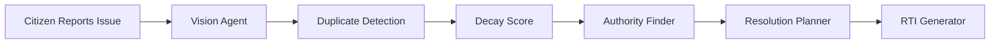

# README Generation Task

Analyze the **entire project** before writing anything.

## Instructions

Read every folder and file in the project, including but not limited to:

* app/
* components/
* agents/
* services/
* hooks/
* utils/
* config/
* lib/
* supabase/
* types/
* middleware/proxy
* package.json
* README.md (if it exists)
* AGENTS.md
* CLAUDE.md

Infer the application's architecture, workflows, technologies, AI pipeline, and design decisions directly from the codebase.

Do **not** assume features that are not implemented. Base the documentation on the actual project while clearly identifying planned or upcoming features where appropriate.

---

# Generate a production-quality README.md

The README should be visually appealing, detailed, and suitable for:

* GitHub
* Hackathon submission
* Recruiters
* Open-source developers

Use professional Markdown with badges, tables, emojis where appropriate, code blocks, and a clean structure.

Include the following sections:

## 1. Project Banner

Project name:

# NEXORA

**Network of Engaged eXperts for Operations And Rapid Action**

A one-line tagline that clearly explains the project.

---

## 2. Overview

Explain:

* What NEXORA is
* The real-world problem it solves
* Why it is different from traditional civic reporting systems

---

## 3. Features

Categorize features such as:

### AI Features

* AI Vision
* Issue Categorization
* Duplicate Detection
* Decay Score
* Authority Finder
* Resolution Planner
* RTI Generator

### Citizen Features

### Dashboard

### Analytics

### Authentication

### Reporting

Only include features that exist or clearly mark future features as "Planned".

---

## 4. AI Agent Workflow

Include a Mermaid flowchart like:

Explain each agent's responsibility.

---

## 5. Project Architecture

Describe:

* Frontend
* Backend
* API Routes
* AI Layer
* Database
* Authentication

Include another Mermaid architecture diagram.

---

## 6. Folder Structure

Generate the current folder tree automatically from the project and explain the purpose of major folders.

---

## 7. Technology Stack

Present in a table:

| Category | Technology |

Include frameworks, libraries, AI models, database, deployment tools, etc.

---

## 8. Screens

List every implemented page and briefly describe its purpose.

---

## 9. Installation

Provide complete setup instructions:

* Clone
* Install
* Environment variables
* Run locally
* Build
* Production

---

## 10. Environment Variables

Document every required variable with descriptions.

---

## 11. API Routes

Document each route with:

* Method
* Purpose
* Request
* Response

---

## 12. Database

Explain the database schema (or planned schema if not fully implemented).

---

## 13. Future Roadmap

Include realistic future enhancements.

---

## 14. Contributing

Provide contribution guidelines.

---

## 15. License

MIT License placeholder.

---

## 16. Credits

Mention:

* Google Gemini
* Supabase
* Next.js
* Tailwind CSS

and any other technologies actually used.

---

# Quality Requirements

* Professional GitHub README
* Well-formatted Markdown
* Clear headings
* Tables
* Mermaid diagrams
* Code snippets
* Installation instructions
* Feature tables
* Architecture diagrams
* Modern badges at the top
* Catchy and memorable wording

Finally, overwrite the existing README.md with the new version and ensure it accurately reflects the current state of the project.
